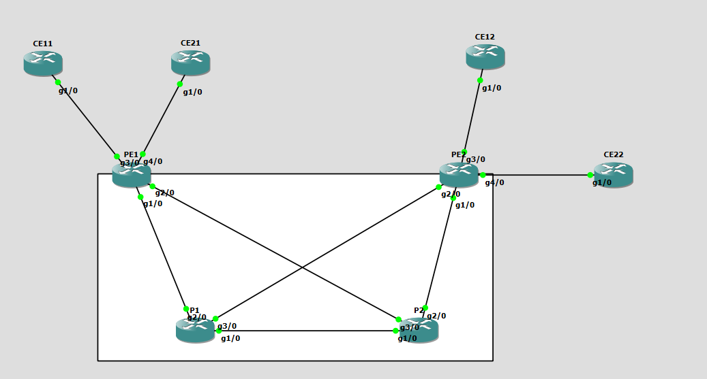
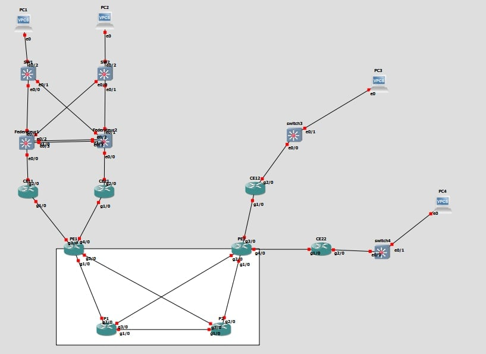
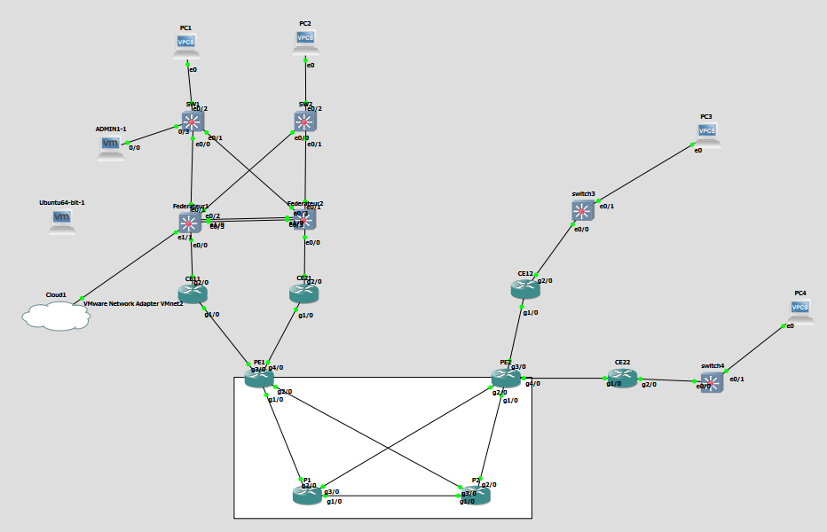
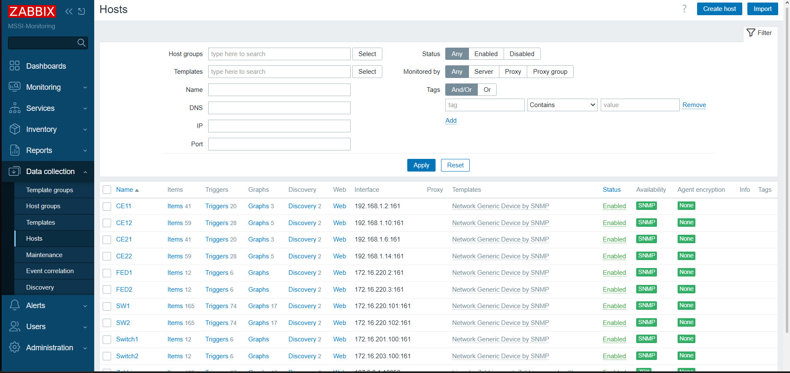
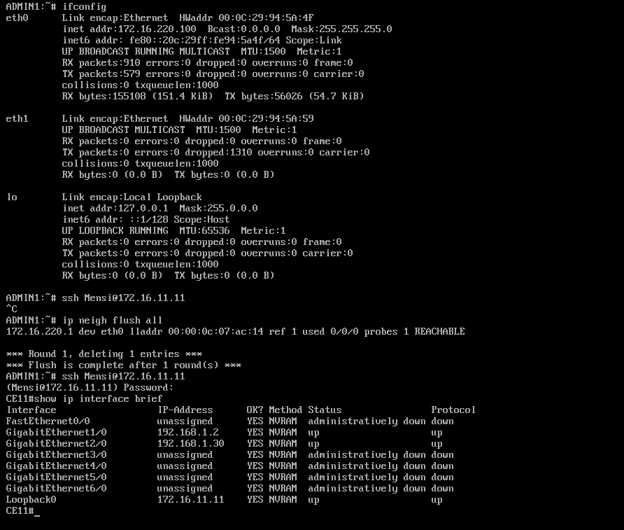
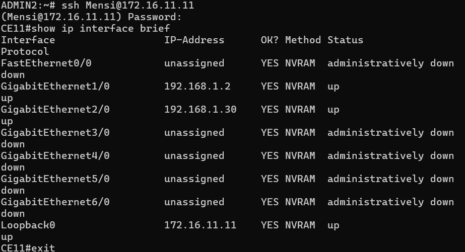

# Enterprise Network Infrastructure — VPN-MPLS, Extended LAN & Monitoring

> Full enterprise network design and implementation: carrier-grade VPN-MPLS 
> backbone, redundant extended LAN, and a complete monitoring/security management 
> plane — built entirely in GNS3 using real Cisco IOS images.

**Author:** Mohamed Mensi
**Supervisor:** Prof. Tarek Hdiji  
**Institution:** ISGT — M1 Information Systems Security, 2025/2026  

---

## 📺 Demo
[▶ Watch the full 15-minute project walkthrough](YOUR_YOUTUBE_LINK_HERE)

---

## Project Scope

This project implements three interdependent infrastructure layers:

| Chapter | Layer | Key Technologies |
|---|---|---|
| 1 | VPN-MPLS Backbone | OSPF, LDP, MP-BGP, VRF, Cisco c7200 |
| 2 | Extended LAN | VLANs, EtherChannel (LACP), HSRP, DHCP, STP |
| 3 | Monitoring & Security | SNMPv3, Zabbix 7.0, Syslog, NTP, IP SLA, ACLs |

---

## Topology Overview

### Chapter 1 — VPN-MPLS Backbone

- **4 Cisco c7200 routers** in a dual-PE / dual-P redundant architecture
- **2 customer VPNs** (VPN_Customer1 and VPN_Customer2) with full traffic isolation via VRF
- **OSPF Area 0** backbone with per-site CE areas (11, 12, 21, 22)
- **MPLS/LDP** label distribution on all backbone links
- **MP-BGP** VPNv4 route exchange between PE1 and PE2
- **VPN isolation verified**: CE11 → CE21 cross-VPN ping = 0% success (confirmed isolation)

### Chapter 2 — Extended LAN

- **Distribution layer**: Federateur1 + Federateur2 (IOU-L2), HSRP active/standby across VLANs 10, 15, 20
- **EtherChannel Po1** (LACP) between Federateurs — 2 physical links bundled, SU state confirmed
- **4 VLANs** at Siège (ISG1/10, ISG2/15, Management/20, Backbone/300) + branch VLANs
- **DHCP** pools on Federateurs (Siège) and CE12/CE22 (branches)
- **OSPF extended** to CE–Federateur links, propagating LAN subnets into the MPLS VPN
- **End-to-end test**: PC1 (Siège, 172.16.210.11) → PC3 (Branch1, 172.16.202.11) across full MPLS backbone — 100% success

### Chapter 3 — Monitoring & Security

- **Zabbix 7.0** on Ubuntu Server 24.04 VM (172.16.220.250), bridged into GNS3 via VMnet2
- **SNMPv3 authPriv** (SHA-1 + AES-128) configured on all 10 devices — CE routers + all switches
- **NTP** synchronization across all devices (Zabbix server as stratum reference)
- **Centralized Syslog** via rsyslog — OSPF events, config changes, interface state changes captured in real time
- **IP SLA** on CE12 and CE22: ICMP echo + UDP jitter toward Siège HSRP gateway (172.16.210.1), 30s intervals, 0 failures
- **Extended ACLs on all VTY lines**: only ADMIN1 (172.16.220.100) and ADMIN2 (172.16.220.150) permitted; `deny any any log` for audit trail

  

---

## IP Addressing Summary

### Backbone (10.1.1.0/24)
| Link | Network | Addresses |
|---|---|---|
| PE1–P1 | 10.1.1.0/30 | PE1: .1, P1: .2 |
| PE1–P2 | 10.1.1.4/30 | PE1: .5, P2: .6 |
| PE2–P2 | 10.1.1.8/30 | PE2: .9, P2: .10 |
| PE2–P1 | 10.1.1.12/30 | PE2: .13, P1: .14 |
| P1–P2 | 10.1.1.20/30 | P1: .21, P2: .22 |

### Loopbacks (Router-IDs)
| Router | Loopback0 |
|---|---|
| PE1 | 1.1.1.1/32 |
| PE2 | 2.2.2.2/32 |
| P1 | 3.3.3.3/32 |
| P2 | 4.4.4.4/32 |

### VLANs (Siège)
| VLAN | Name | Subnet |
|---|---|---|
| 10 | ISG1 | 172.16.210.0/24 |
| 15 | ISG2 | 172.16.215.0/24 |
| 20 | Management | 172.16.220.0/24 |
| 300 | Backbone | 192.168.1.44/30 |

---

## Key Challenges Solved

1. **IOU license hostname mismatch** — IOU images failed to load due to hostname validation against license key; resolved by aligning hostnames to license constraints
2. **GNS3 VM VT-x crash under Windows Hyper-V** — hypervisor conflict caused GNS3 VM to fail on startup; resolved by disabling Hyper-V and enabling VT-x exclusively for VMware
3. **EtherChannel LACP port suspension** — ports entered suspended state due to STP priority misconfiguration before EtherChannel was up; resolved by correcting STP root bridge assignment first
4. **STP unicast frame drops at Dynamips ↔ GNS3 VM boundary** — unicast frames were dropped crossing the local/VM boundary; resolved by triggering STP reconvergence via explicit `spanning-tree vlan X root primary/secondary` commands, flushing MAC tables
5. **OSPF not propagating LAN subnets into MPLS VPN** — passive-interface default on Federateurs blocked OSPF on CE-facing links; resolved by explicitly removing passive mode on VLAN300 and Ethernet0/0
6. **Zabbix SNMPv3 authPriv polling failures** — Zabbix was not reaching devices despite correct credentials; resolved by verifying SNMP engine ID consistency and correct interface reachability via management VLAN routing
7. **CE22 enable secret recovery** — forgotten enable password on CE22; recovered via GNS3 console break sequence and config-register manipulation, hash cracked using passlib

---

## Tools & Environment

| Component | Version / Details |
|---|---|
| GNS3 | 2.2.56.1 (local mode, Windows 10) |
| Router Platform | Cisco c7200, NPE-400 |
| IOS Version | 15.2(4)M7 |
| Switch Platform | Cisco IOU-L2 |
| Monitoring | Zabbix 7.0 on Ubuntu Server 24.04 |
| RAM per Router | 512 MB |

---

## Verification Results Summary

| Test | Result |
|---|---|
| OSPF adjacencies (all routers) | ✅ FULL state |
| MPLS/LDP neighbors (all backbone links) | ✅ Oper state |
| VPN route exchange (MP-BGP VPNv4) | ✅ \*>i routes confirmed |
| CE-to-CE ping (same VPN) | ✅ 100% (5/5) |
| VPN isolation (cross-VPN ping) | ✅ 0% (confirmed blocked) |
| EtherChannel Po1 | ✅ SU, both ports P |
| HSRP (Federateur1 Active) | ✅ Priority 110, preempt |
| DHCP (all 4 PCs) | ✅ Correct pools and gateways |
| End-to-end PC1→PC3 across MPLS | ✅ 100% (5/5) |
| SNMPv3 authPriv polling (all 10 devices) | ✅ Green in Zabbix |
| Syslog reception | ✅ OSPF/STP/config events received |
| IP SLA (CE12 + CE22) | ✅ 0 failures, ~62ms RTT |
| VTY ACL (ADMIN1 permitted) | ✅ SSH established |
| VTY ACL (Zabbix server blocked) | ✅ Connection timed out |
